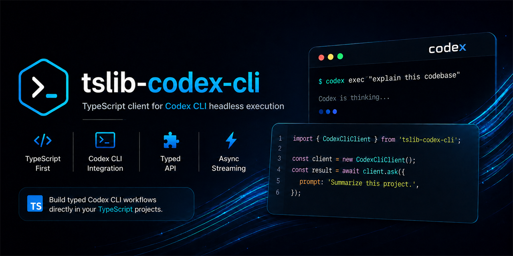

<div align="center">
  
</div>

# tslib-codex-cli

[](https://github.com/Crome696/tslib-codex-cli/actions/workflows/ci.yml)
[](LICENSE)

`tslib-codex-cli` is a standalone TypeScript client for the installed Codex CLI's non-interactive headless surface. It invokes `codex exec`, `codex exec resume`, and `codex exec review` through a shell-free Node.js process boundary and normalizes text and JSONL output into typed results.

The package targets Node.js 22 or newer, has no declared runtime dependencies, and produces ESM, CommonJS, and TypeScript declaration output when built.

## Project snapshot

| Property       | Value                                              |
| -------------- | -------------------------------------------------- |
| Runtime        | Node.js 22+                                        |
| Module formats | ESM and CommonJS                                   |
| Type output    | TypeScript declarations                            |
| CLI dependency | An installed `codex` executable                    |
| License        | MIT                                                |
| Test model     | Offline checks plus an optional real-CLI E2E suite |

## What it does

The library gives Node.js and TypeScript applications a typed process boundary around the Codex CLI's current headless commands. It builds CLI arguments deterministically, executes the configured executable without shell interpolation, parses text or JSONL output, and returns structured success or failure results.

Authentication, credential storage, provider policy, permissions, and model availability remain responsibilities of the installed Codex CLI. This package does not accept, store, print, or manage API keys, access tokens, login sessions, or other credentials.

## Key features

- ESM, CommonJS, and TypeScript declaration output from one public entry point.
- Runtime-dependency-free package design with an injectable command runner for offline tests.
- Typed argument construction for models, images, profiles, config overrides, feature toggles, providers, sandboxes, working directories, output schemas, colors, and forward-compatible `extraArgs`.
- Aggregate `text` or `jsonl` results with thread IDs, usage, raw events, and typed item projections.
- Async JSONL streaming with normalized lifecycle events and clean abort/close handling.
- Convenience operations for read-only planning, read-only questions, session resume, code review, and CLI health diagnostics.
- Categorized validation, CLI availability, authentication, permission, timeout, abort, exit, parse, configuration, and unknown failures.
- Diagnostic sanitization that strips ANSI sequences, redacts common credential patterns, and limits diagnostic length.

## Architecture


The public entry point in `src/index.ts` exposes the client, runner, argument builder, parsers, error types, and operation types. The client coordinates validation, argument construction, process execution, parsing, and error normalization.

## Project structure

```text
.
├── src/
│   ├── index.ts
│   └── lib/codex/
│       ├── args.ts
│       ├── client.ts
│       ├── command-runner.ts
│       ├── errors.ts
│       ├── parsers.ts
│       ├── types.ts
│       └── validation.ts
├── tests/e2e/
│   └── codex-cli.e2e.spec.ts
├── .github/workflows/ci.yml
├── package.json
├── tsconfig.json
├── tsup.config.ts
├── vitest.config.ts
└── vitest.e2e.config.ts
```

Unit specifications are colocated with the implementation modules under `src/lib/codex/`. The E2E suite is isolated under `tests/e2e/`.

## Getting started

### Prerequisites

- Node.js 22 or newer.
- The Codex CLI installed locally and available as `codex` on `PATH`, unless an explicit executable path is supplied.
- A separately authenticated Codex CLI when the selected provider requires authentication.

### Set up from source

The package is currently documented as a source/local-package workflow rather than a registry installation:

```sh
git clone https://github.com/Crome696/tslib-codex-cli.git
cd tslib-codex-cli
npm ci
npm run build
```

Run `npm pack` after building to create a local package archive for installation from another project.

## Usage and examples

### ESM

```ts
import { CodexCliClient } from 'tslib-codex-cli';

const client = new CodexCliClient();
const result = await client.ask({
  prompt: 'Summarize the repository architecture.',
  outputFormat: 'text',
});

if (result.ok) {
  console.log(result.value.text);
} else {
  console.error(result.error.category, result.error.message);
}
```

Aggregate operations return typed JSONL output by default. Select `outputFormat: 'text'` when the raw text response is preferred.

### CommonJS

```js
const { CodexCliClient } = require('tslib-codex-cli');

async function main() {
  const client = new CodexCliClient({ executable: 'codex' });
  const result = await client.ask({
    prompt: 'Explain the public API without changing files.',
    outputFormat: 'text',
  });

  if (result.ok) {
    console.log(result.value.text);
  }
}

main().catch(console.error);
```

### Direct execution

`run()` maps to `codex exec`. Known current flags are typed and ordered deterministically, including models, images, profiles, config overrides, feature toggles, provider selection, sandbox and approval controls, working directories, additional directories, output schema, color, last-message output, JSONL, and explicit `extraArgs` for forward compatibility.

```ts
const result = await client.run({
  prompt: 'Implement the requested change.',
  model: 'gpt-5-codex',
  sandbox: 'workspace-write',
  cwd: './project',
  addDirs: ['./shared-fixtures'],
  outputFormat: 'jsonl',
});
```

Write-enabling and bypass options are available only through the explicit `run()` API. Use them only when the surrounding application has an independent safety boundary.

### Read-only planning and questions

`plan()` and `ask()` are convenience methods over `codex exec`, not invented Codex subcommands. They add read-only instruction prefixes, default to `--sandbox read-only`, and reject approval, bypass, additional-directory, and other write-enabling options before the process starts.

```ts
const plan = await client.plan({
  prompt: 'Propose an implementation plan for the issue.',
});

const answer = await client.ask({
  prompt: 'What does this module do?',
  outputFormat: 'text',
});
```

### Resume and review

`resume()` maps to `codex exec resume` and requires either a session ID or `last: true`. `all: true` disables the CLI's working-directory filtering.

```ts
const resumed = await client.resume({
  sessionId: '00000000-0000-0000-0000-000000000000',
  prompt: 'Continue from the previous turn.',
});

const review = await client.review({
  uncommitted: true,
  title: 'Review current changes',
  prompt: 'Focus on correctness and regressions.',
});
```

Review targets are mutually exclusive; use `base` or `commit` instead of `uncommitted` for the other current review targets.

### JSONL streaming

`stream()` always requests JSONL and yields normalized lifecycle and item events as complete lines arrive.

```ts
for await (const event of client.stream({
  prompt: 'Inspect the repository in read-only mode.',
  sandbox: 'read-only',
})) {
  if (event.type === 'item.completed') {
    console.log(event.item.type);
  }
}
```

Stopping or aborting the async iteration closes the underlying child process. Pass an `AbortSignal` and `timeoutMs` through the operation input when the process needs an explicit lifetime.

### Health diagnostics

`health()` runs `codex --version` and the redacted `codex doctor --json --summary` path. It does not run login, change authentication state, or send a model request.

```ts
const health = await client.health();

if (health.ok) {
  console.log(health.value.version, health.value.authenticated);
}
```

## Configuration and operations

### Client options

`CodexCliClient` accepts the following constructor options:

| Option       | Purpose                                                                                  |
| ------------ | ---------------------------------------------------------------------------------------- |
| `executable` | Use a specific Codex executable or Windows command shim. Defaults to `codex`.            |
| `cwd`        | Set the default working directory for child processes.                                   |
| `env`        | Provide an environment overlay to the child process.                                     |
| `timeoutMs`  | Set the default positive execution timeout.                                              |
| `runner`     | Inject a `CodexCommandRunnerLike` implementation for tests or custom process boundaries. |

### Operation reference

| Method          | CLI surface                                           | Behavior                                                                                                                                                        |
| --------------- | ----------------------------------------------------- | --------------------------------------------------------------------------------------------------------------------------------------------------------------- |
| `run(input)`    | `codex exec`                                          | Executes the full explicit run API. Write-enabling and bypass options are available here and require an independent safety boundary in the calling application. |
| `plan(input)`   | `codex exec`                                          | Read-only planning convenience operation with write-enabling options rejected.                                                                                  |
| `ask(input)`    | `codex exec`                                          | Read-only question convenience operation with write-enabling options rejected.                                                                                  |
| `resume(input)` | `codex exec resume`                                   | Continues a session by ID or with `last: true`.                                                                                                                 |
| `review(input)` | `codex exec review`                                   | Reviews an uncommitted tree, base, or commit target.                                                                                                            |
| `stream(input)` | `codex exec --json`                                   | Yields normalized `CodexEvent` values as an async generator.                                                                                                    |
| `health()`      | `codex --version` and `codex doctor --json --summary` | Reports executable availability, version, authentication state, and sanitized diagnostics.                                                                      |

Common operation inputs include `model`, `outputFormat`, `sandbox`, `cwd`, `images`, `addDirs`, `stdin`, `signal`, `outputSchema`, config toggles, and array-based `extraArgs`. Known flags are typed and ordered deterministically.

When `prompt` is `'-'`, Codex reads the prompt from stdin. The optional `stdin` property supplies that content; supplying stdin with a normal prompt follows the CLI behavior of appending a stdin block.

`extraArgs` is an explicit array escape hatch for flags introduced by newer CLI versions. It never enables shell interpolation.

## Development and testing

### Offline checks

The default checks do not make authenticated Codex calls:

```sh
npm ci
npm run typecheck
npm test
npm run lint
npm run format:check
npm run build
npm run pack:check
git diff --check
```

The GitHub Actions workflow runs these checks on pushes and pull requests targeting `master`, using Node.js 22.

### Real Codex CLI E2E suite

The local E2E suite runs against the real `codex` executable and is intentionally separate from the offline checks. Before running it, install and authenticate the Codex CLI locally and ensure that network access is available:

```sh
npm run test:e2e
```

The suite exercises health detection, read-only execution, plan, ask, resume, review of a temporary Git fixture, and JSONL streaming. If the CLI is missing or unauthenticated, the suite fails with an actionable diagnostic instead of silently skipping. The normal `npm test` command remains offline.

## Security, data handling, and limitations

- Production execution uses `node:child_process.spawn` with an argument array and `shell: false`.
- Credentials are not accepted, stored, printed, or managed by this library.
- CLI stderr and diagnostics are ANSI-stripped, length-limited, and redacted for common API-key, token, password, secret, bearer, and credential forms.
- Environment overlays are passed only to the child process and are not copied into returned results or error diagnostics.
- `plan()` and `ask()` reject approval flags, bypass flags, writable-directory expansion, and write-enabling configuration overrides.
- `run()` exposes explicit write-enabling controls; callers must establish their own independent safety boundary before using them.
- The installed Codex CLI remains responsible for authentication, credential storage, provider policy, permissions, and model availability.

This package does not implement the interactive TUI, `codex app-server`/JSON-RPC, ACP, login or credential management, MCP/plugin/skill administration, hooks, daemons, subagents, or cloud APIs.

## License and credits

This project is released under the [MIT License](LICENSE).

Copyright © 2026 Crome696.
